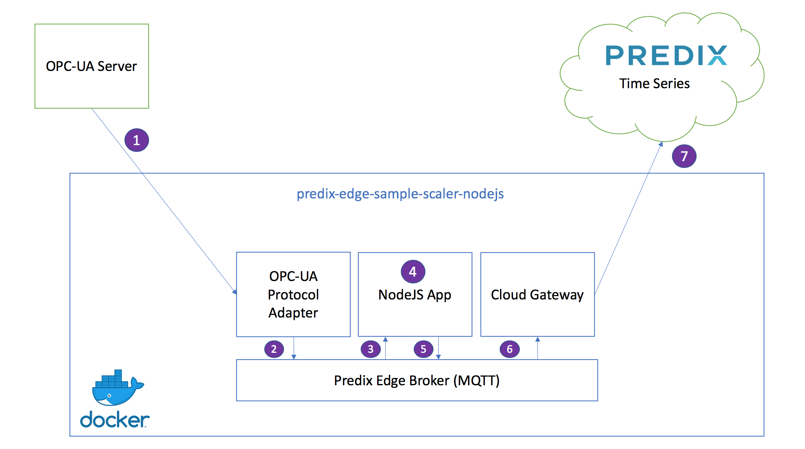

## Predix Edge Sample Scaling App in NodeJS

The intent of this app is to illustrate building and deploying a basic Predix Edge app that communicates with other common Predix Edge comtainer services.  The functionality is intended to be extremely simple with the focus being on the fundamentals of constructing the app.

## Architecture of Sample App

The OPC-UA Protocol Adapter, the Predix Edge Broker, the Cloud Gateway, and the NodeJS App work as a multi-container Docker application. As the application is currently configured, its data will flow through the diagram in seven stages:

1. The OPC-UA Protocol Adapter subscribes to data with particular tags (configured [here](config/config-opcua.json)) coming from an OPC-UA server.
2. The OPC-UA Protocol Adapter publishes that data to the Predix Edge MQTT Broker on the topic "app_data".
3. The NodeJS app subscribes to data from the Predix Edge MQTT Broker with the topic "app_data".
4. The NodeJS app looks for data with the tag "My.App.DOUBLE1" - if it has that tag, the app modifies the data. In this case, it multiplies it by 1000, but you can change it to modify it any way you would like. It then tags the data with the tag "My.App.DOUBLE1.scaled_x_1000".
5. The NodeJS app publishes that data to the Predix Edge MQTT Broker on the topic "timeseries_data". (Note: it is not a requirement to publish to a different topic you subscribed to.)
6. The Cloud Gateway subscribes to data from the Predix Edge MQTT Broker with the topics "app_data" or "timeseries_data".
7. The Cloud Gateway publishes data with the topic "timeseries_data" to Predix Time Series.



#### Software You will Need

In order to develop and run this sample locally you will need:
* [**NodeJS**](https://nodejs.org/en/)
* [**NPM**](https://www.npmjs.com/)
* [**Docker**](https://www.docker.com/)
* The *UAA URL*, *ClientID* and *Secret* for the Predix Cloud Time Series service to which you wish to ingest the app's output.


Once you have NodeJS and npm installed, install the dependencies using the `npm install` command.

This app also uses [Mocha](https://mochajs.org/) and [Chai](https://www.chaijs.com/) in the test suite, which will be downloaded as part of the dependencies. To run the tests, run `npm test` from the `src` file of the project. As you make this application your own, please extend the tests to fit your needs.

In order to devlop and run this sample locally you will need:

* [**NodeJS**](https://nodejs.org/en/)
* [**NPM**](https://www.npmjs.com/)
* [**Docker**](https://www.docker.com/)
* The *UAA URL*, *ClientID* and *Secret* for the Predix Cloud Time Series service to which you wish to ingest the app's output.


Once you have NodeJS and npm installed, install the dependencies using the `npm install` command.

This app also uses [Mocha](https://mochajs.org/) and [Chai](https://www.chaijs.com/) in the test suite, which will be downloaded as part of the dependencies. To run the tests, run `npm test` from the `src` file of the project. As you make this application your own, please extend the tests to fit your needs.


#### Step 1: Install the core Predix Edge components

To get started developing locally you will need to pull the core Predix Edge Docker images onto your local machine.  

This will first require you to logon to the Predix Docker Trusted Registry (DTR).  We are supplying all developers with the temporary credentials listed below.

Ensuring that Docker is running on your machine, run the following commands:

```bash
$ docker login dtr.predix.io
$ Username: edge-user
$ Password: ,cwB^[/]2WQDXK&_
```

Now pull in the images our app will use.

```bash
$ docker pull dtr.predix.io/predix-edge/predix-edge-broker:amd64-latest

$ docker pull dtr.predix.io/predix-edge/protocol-adapter-opcua:amd64-latest

$ docker pull dtr.predix.io/predix-edge/cloud-gateway:amd64-latest
```
Finally, create a [Docker Swarm](https://docs.docker.com/engine/swarm/) on your machine.  You only need to do this once on your machine.  If you have done so in the past you can disregard this step.

```bash
$ docker swarm init
```

#### Step 2: Clone this Repository

Clone this repository to download all of the source code.
```bash
$ git clone git@github.com/PredixDev/predix-edge-sample-scaler-nodejs.git
```

#### Step 3: Review the App Functionality
The functionality of this NodeJS app is located in the **src** folder in a file named **index.js**.  Please review the file and the comments around each line to understand how it works.


#### Step 4: Create a Docker image of the App

The [Dockerfile](https://docs.docker.com/engine/reference/builder/) is used to compile your app into a Docker image that can be run in Predix Edge .  Please review the file and the comments around each like to understand how it works.


The *docker build* command is used to generate the docker image from the source code of your app.  Executing this command from the commandline will create a Docker image named **my-nodejs-edge-app** with a version of **1.0.0**.

```bash
$ docker build -t my-nodejs-edge-app:1.0.0 .
```
If your build machine is behind a proxy you will need to specify the proxies as build arguments.  You can pull in the proxy values from the environment variables on your machine.

The *docker build* command is used to generate the docker image from the source code of your app.  Executing this command from the commandline will create a Docker image named **my-edge-app** with a version of **1.0.0**.

```bash

$ docker build --build-arg http_proxy=$http_proxy --build-arg https_proxy=$https_proxy -t my-nodejs-edge-app:1.0.0 .

```

If your build machine is behind a proxy you will need to specify the proxies as build arguments.  You can pull in the proxy values from the environment variables on your machine.

```bash
$ docker build --build-arg http_proxy=$http_proxy --build-arg https_proxy=$https_proxy -t my-nodejs-edge-app:1.0.0 .
```
After the build completes you can see your image, as well as the core Predix Edge images we pulled onto your machine with the *docker images* command.

```bash
$ docker images
```
#### Step 5: Configure the App
Predix Edge apps contain a series of configuration files to define parameters for the app's deployment and execution.  Our app contains the following configuration files.

#### docker-compose.yml
App deployment parameters are defined in the **docker-compose.yml** file.  This file defines the Docker images used to construt the application.  It also contains parameters for configuring the image, such as any  specific configuration files required by each image.

Our project includes a *docker-compose.yml* file and a *docker-compose-dev.yml* file.  The "-dev" version is configured to run the app locally on your machine.  The "non-dev" version is used to deploy the app to an actual Predix Edge device or VM.

The primary differences in the "non-dev" include:

- Removal of all volume mounts.  Predix Edge will automatically inject a **/config** and **/data** volume into your app at runtime.
- Removal of Proxy and DNS settings.  Apps running on a Predix Edge device will utilize these values configured on the device.
- Removal of the predix-edge-broker service.  This service is pre-installed on the Predix Edge VM.
- Addition of a Docker network to allow the services to interact with the predix-edge-broker on the Predix Edge VM

The only change you may have ot make in the "-dev" version of this file is the proxy settings for the Cloud Gateway service.  Change the **https_proxy** value if your machine is behind a different proxy.

```yaml
  cloud_gateway:
    image: "dtr.predix.io/predix-edge/cloud-gateway:amd64-latest"
    environment:
      config: "/config/config-cloud-gateway.json"
      https_proxy: "$https_proxy"
```

#### config/config-opcua.json
This configuration file is utilized by the OPC-UA Protocol Adapter image to connect to an OPC-UA server, subscribe to a series of 3 tags and publish the results on the data broker in a Time Series format.  It is configured to use an OPC-UA simulator running on the GE network.  Unless you would like to connect to a different server or simulator, you should not have to change this file.

Below is a subset of the config file highlighting key properties you would change if obtaining data form a different OPC-UA server:

- **transport_addr** - the IP address or URL to the OPC-UA server
- **data_map** - the array of tags the app is subscribing to
- **node_ref** - in the mqtt section is the topic on which the OPC-UA data will be published to the data broker for consumption by the other containers in the app

```json
    "opcua": {
      "type": "opcuasubflat",
      "config": {
          "transport_addr": "opc-tcp://3.39.89.86:49310",
          "log_level": "debug",
          "data_map": [
            {
              "alias": "Integration.App.Device1.FLOAT1",
              "id": "ns=2;s=Simulator.Device1.FLOAT1"
            },
            {
              "alias": "Integration.App.Device1.FLOAT2",
              "id": "ns=2;s=Simulator.Device1.FLOAT2"
            },
            {
              "alias": "Integration.App.Device1.FLOAT3",
              "id": "ns=2;s=Simulator.Device1.FLOAT3"
            }
          ]
      }

    "mqtt": {
        "type": "cdpout",
        "config": {
            "transport_addr": "mqtt-tcp://predix-edge-broker",
            "node_ref": "opcua_data",
            "method": "pub",
            "log_level": "debug",
            "log_name": "opcua_mqtt"
        }
```
#### config/config-cloud-gateway.json
This file is used by the Cloud Gateway service and contains properties indicating which Predix Cloud Time Series service to inject the data.

- **transport_addr** - (in the Time Series section) is the websockets URL for your Predix Cloud Time Series service.  Note, the Cloud Gateway container uses its own protocol prefixes for sending data to different destinations.  You are likely used to seeing this as wss://.  For this component, pxtss:// should be the protocol prefix of the URL.  Everything else is exaclty as defined by your Predix Cloud Time Series service.
- **predix_zone_id** - (in the Time Series section) is the zone ID of the Time Series service you with to transmit the data to
- **node_ref** - (in the mqtt section) is the topic on which the Cloud Gateway service will subscribe to data published by the app to be injected into the Time Series database.  If you recall the sample app source code, **timeseries_data** is the topic to which the scaled values are put back on the broker.

**Action**: *You should change the value of **predix_zone_id** and ingestion URL to match the Predix Time Series service to which you intend to publish data when running this sample.*

```json
  "time_series_sender": {
      "type": "timeseries",
      "config": {
          "log_name": "ts_sender",
          "log_level": "debug",
          "mqtt": {
              "transport_addr": "mqtt-tcp://predix-edge-broker",
              "qos": 2,
              "client_id": "time_series_sender_mqtt_client",
              "topics": [
                  "app_data"
              ]
          },
          "store_forward": {
              "policy": "store_always",
              "max_store_size": 90,
              "max_store_size_units": "%",
              "max_batch_interval": 1000
          },
          "timeseries": {
              "transport_addr": "wss://gateway-predix-data-services.run.aws-usw02-pr.ice.predix.io/v1/stream/messages",
              "predix_zone_id": "your-predix-zone-id",
              "token_file": "/edge-agent/access_token",
              "proxy_url": "$https_proxy"
          }
      }
    }
```

# Running the App and Verifying the Data

There are three different ways in which you can run your application. For debug reasons, you can run it locally just as you would any other NodeJS application. You can also run it in a local Docker container on your machine, or you can deploy your packaged application to a Predix Edge OS VM.

#TODO Add three ways to run, just like python

#### Option 1: Run the App in a Local Container
The result of this app is to publish a scaled value to Predix Cloud Time Series.  In order to do so, they app requires a UAA token with permissions to ingest data.  On a Predix Edge device, apps obtain this token from the device once it is enrolled to Edge Manager.

##### Step 1: Get Access Token
During development, though, you must generate a token to be used by the app.  To do so, we have included a **get-access-token.sh** script that will obtain a UAA token and put it in a location that is accessible by the app.

The script takes three input parameters:
- my-client-id - the client id for your instance of UAA: it must have permissions to ingest data into your Time Series instance
- my-secret - the client secret for that client id
- my-uaa-url - must be the full URL including the /oauth/token ending

```bash
$ ./get-access-token.sh my-client-id my-secret -my-uaa-url
```

After you run the script, a file names *access_token* will be created in the data folder of the app.  The app is configured to use this file to obatin the token for transmitting data to the cloud.

##### Step 2: Run the Application

To run the app, execute the following command from the commandline.  This will run the app with the "-docker" version of the docker-compose file.

```bash
$ docker stack deploy --compose-file docker-compose-docker.yml my-nodejs-edge-app
```
##### Step 3: Check Status of Application
```bash
$ docker ps -a
```

You van view the logs generated by each container in the app by executing the docker logs command and passing in the CONTAINER ID for any of the running containers.

For example (where 0000000000 is one of the container ids displayed from your docker ps output):

```bash
$ docker logs 0000000000
```

#### Option 2: Run the App Locally

This is very similar to Option 1, only instead of running the application in a Docker container, you run it locally on your machine.


##### Step 1: Get Access Token
During development, though, you must generate a token to be used by the app.  To do so, we have included a **get-access-token.sh** script that will obtain a UAA token and put it in a location that is accessible by the app.

The script takes three input parameters:
- my-client-id - the client id for your instance of UAA: it must have permissions to ingest data into your Time Series instance
- my-secret - the client secret for that client id
- my-uaa-url - must be the full URL including the /oauth/token ending

```bash
$ ./get-access-token.sh my-client-id my-secret -my-uaa-url
```
After you run the script, a file named *access_token* will be created in the data folder of the app.  The app is configured to use this file to obtain the token for transmitting data to the cloud.

To run the app, execute the following command from the commandline.  This will run the app with the "-docker" version of the docker-compose file.

```bash

$ docker stack deploy --compose-file docker-compose-docker.yml my-nodejs-edge-app
```
##### Step 3: Check Status of Application
```bash
$ docker ps -a
```

You van view the logs generated by each container in the app by executing the docker logs command and passing in the CONTAINER ID for any of the running containers.

For example (where 0000000000 is one of the container ids displayed from your docker ps output):

```bash
$ docker logs 0000000000
```

#### Option 2: Run the App Locally

This is very similar to Option 1, only instead of running the application in a Docker container, you run it locally on your machine.


##### Step 1: Get Access Token
During development, though, you must generate a token to be used by the app.  To do so, we have included a **get-access-token.sh** script that will obtain a UAA token and put it in a location that is accessible by the app.

The script takes three input parameters:
- my-client-id - the client id for your instance of UAA: it must have permissions to ingest data into your Time Series instance
- my-secret - the client secret for that client id
- my-uaa-url - must be the full URL including the /oauth/token ending


##### Step 3: Start Your Application

```bash

node src/index.js local
```

##### Step 4: Check Status of Application
```bash
$ docker ps -a
```

You van view the logs generated by each container in the app by executing the docker logs command and passing in the CONTAINER ID for any of the running containers.

For example (where 0000000000 is one of the container ids displayed from your docker ps output):

```bash
$ docker logs 0000000000
```

#### Option 3: Package and Deploy the App to a Predix Edge VM

Packaging the app involves creating a tar.gz file with your app's Docker images and docker-compose.yml file.  You then create a zip file containing your app's configuration files.

Note, you do not need to package the Predix Edge Broker image as it is already installed on the Predix Edge VM.

Create the **app.tar.gz** file:
```bash

$ docker save -o images.tar my-nodejs-edge-app:1.0.0 dtr.predix.io/predix-edge/protocol-adapter-opcua:amd64-latest dtr.predix.io/predix-edge/cloud-gateway:amd64-latest


$ tar -czvf app.tar.gz images.tar docker-compose.yml
```

Create the **config.zip** file.  

*Note, you only want to zip up the actual files, not the config folder that contains the files*.

```bash
$ cd config
$ zip -X -r ../config.zip *.json
$ cd ../
```

Once you have created these two files, you can upload them to your Edge Manager's repository and deploy them to your enrolled Predix Edge VM.

#### Verify the App Data

If the app is working, you should see a tag named **My.App.DOUBLE1.scaled_x_1000** in your Predix Cloud Time Series service.  Use a tool such as Postman or the Predix Tool Kit API Explorer to query timeseries and view your data.

[](https://github.com/PredixDev)
